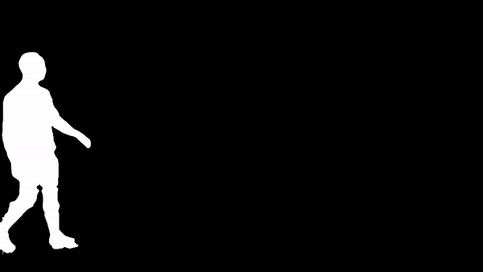
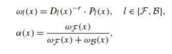

# Video_Background_Changer

  <h2>
    Quick Explanation
  </h2>
  

    The following algorithm gets an input video from a stationary camera or a relatively stable video of a singe moving object. 
    The algorithm will extract the background and the object separately - with background substraction. 
    You can choose any background you want (image or video) and you will get a new video which combine the object and the new background.  
    * Project partner - Daniel Kozoyatov https://github.com/kozoyatov
  

  <table style="width:100%">
  <tr>
    <th>Input: Original shaky video</th>
    <th colspan="2">Output: Stable video + changed BG + tracker</th>
  </tr>
  <tr>
    <td></td>
    <td></td>
  </tr>
</table>

  

  <h2>
    Stabilization
  </h2>
  

    For get better results I recommend use a stationary camera.<tr>
    If you do not have a stationary camera try to film the video as stable as you can, then the following algorithm will stabilze your video.<tr> 
  
  

    

      <h4>
        Stabilization Algorithm:
      </h4>
      <ul>
        <li> The stabilization algorithm read the input video frame by frame.</li>
        <li>On each frame (frame_i) it using cv2.goodFeaturesToTrack to get the "interesting" points.</li>
      </ul>
      

        </li>
      
  
      <ul>  
        <li>Then it is using cv2.calcOpticalFlowPyrLK where the input videos are: frame_i, frame_i+1,<tr>
        this functions gives us the matching points between two sequential frames.</li>
        <li>With cv2.findHomography we now have the transformation matrix between each two frames.</li>
        <li>For each element in the transform matrix we calculate his trajectory by doing cumulative sum between all tramsform          matrixes.</li>  
        <li>To get better results we will "smooth" the trajectory with moving average filter:</li>
      </ul>
      

               
      
      
 
    
  
    
  <table style="width:100%">
  <tr>
    <th>Input: unstable video</th>
    <th colspan="2">Output: stable video</th>
  </tr>
  <tr>
    <td></td>
    <td></td>
   
  </tr>
</table>

  

  <h2>
    Background Substraction  
  </h2> 
  

  In this part we will extract the background without the object<tr> 
  

  <ul>
    <li>We will randomly sample 50 frames from the original video and we will use Median filter for extracting the background.</li>
    <li>Now we will read the input video again and we will subtract the background from each frame.</li>
    <li>By using threshold on absolute subtraction value we got a binary mask.</li>
    <li>Finally we can extract the object by multiple each frame with the current mask.</li>
  </ul>  
  

     
  
  
  <table style="width:100%">
  <tr>
    <th>Binary Mask</th>
    <th colspan="2">Extracted</th>
  </tr>
  <tr>
    <td></td>
    <td></td>
   
  </tr>
</table>

  <h2>
    Matting
  </h2> 
  

  In this part we will work on Value plane (HSV).
  

  
  <table style="width:100%">
    <tr>
      <th>From last section we got the binary mask, therefore we can easly extract the object.</th>
      <th colspan="2">The matting operation executed on the borders.</th>
    </tr>
    <tr>
      <td></td>
      <td> </td>
    </tr>
  </table>
  <ul>
    <li>We will calculate the PDF of the object - P(C|F) and the PDF of the background - P(C|B)</li>
    <li>Finally we will find the likelihood of each pixel (on the border) - if it belongs to BG or to the object.</li>
  </ul>
  

    
  
 
  <ul>
    <li>After calculating the probability of each frame we will calculate the geodesic distance for each frame (from BG and from the object.</li>
    <li>Geodesic distance calculation executed with <a href="https://github.com/taigw/GeodisTKl">GeodisTKl</a>.</li>
  </ul>    
  

     
  
 
  <h3>Alpha</h3>
  
In this section we will calculate alpha matrix with the following formula:

  

    
  

  
Alpha zoom in:

  

     
  

  
Finally we will get the new video with the following formula (frame by frame):

  

    
  

  
Frame from final result:

  

    
  

